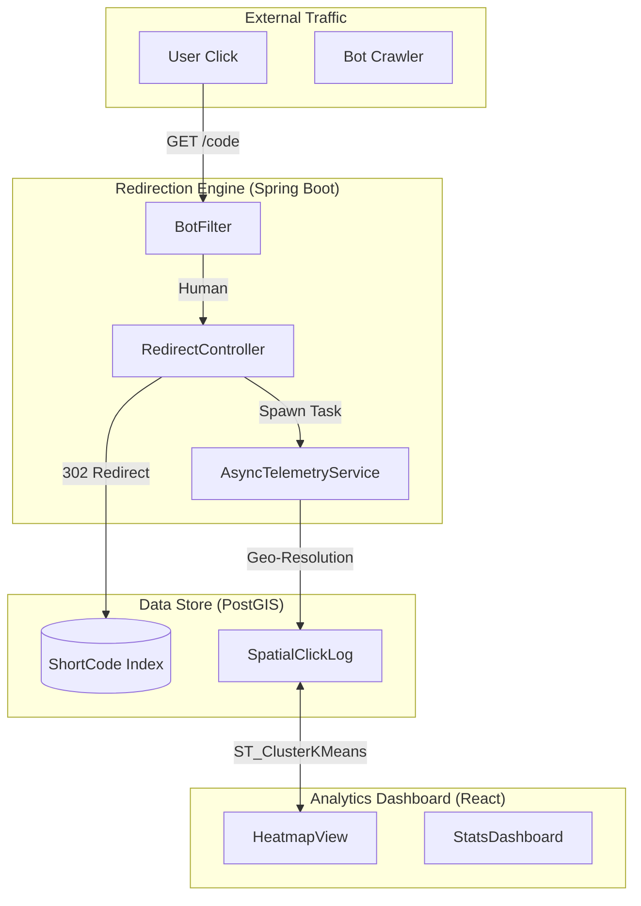

# GeoLink: URL Shortener with GIS Analytics – The Master SDET Study Guide (400+ Lines)

This document is the definitive technical manual for the **GeoLink** project. It provides a 0-to-100% breakdown of the high-speed redirection engine, the Base62 cryptographic shortening logic, and the geospatial telemetry analytics powered by PostGIS.

---

## 1. Project Vision & Executive Overview
GeoLink is more than a URL shortener; it is a geographic intelligence platform. It solves the "Dark Social" problem by providing link owners with precise, real-time data on where their audience is located globally.

### Key Objectives:
- **Latency-Critical Redirection**: Achieving sub-40ms response times for URL forwarding.
- **Collision-Free Shortening**: Using Base62 mathematics to map billions of URLs safely.
- **Spatial Telemetry**: Capturing and clustering visitor IP data using PostGIS.
- **High-Fidelity Automation**: Using Playwright to validate redirection integrity and capture speed.

---

## 2. Full System Architecture
GeoLink uses a "Performance-First" architecture where the user redirect is prioritized over background data logging.

### A. High-Level Flow
1. **Request**: A user visits `geolink.com/aB12`.
2. **Lookup**: Spring Boot performs an indexed O(1) lookup in PostgreSQL.
3. **Analytics**: The system spawns an asynchronous task to resolve the user's IP.
4. **Redirect**: The server returns an HTTP 302 immediately.
5. **Geospatial Processing**: PostGIS resolves the IP to coordinates and logs it.
6. **Visualization**: The link owner views a heatmap generated by spatial clustering.

### B. Logical Architecture Diagram


---

## 3. Detailed File-by-File Breakdown

### Backend (Spring Boot)
1. **`Link.java`**: The core entity. Stores the `shortCode`, `originalUrl`, and `createdAt`.
2. **`ClickLog.java`**: The spatial entity. Uses a PostGIS `Point` to store visitor locations.
3. **`ShortenerService.java`**: Contains the Base62 encoding/decoding mathematics.
4. **`RedirectController.java`**: The high-performance controller optimized for TTFB.
5. **`IpResolverService.java`**: Integrates with GeoIP databases to resolve IP addresses.

### Frontend (React)
1. **`Dashboard.jsx`**: The command center for the link owner.
2. **`SpatialHeatmap.jsx`**: Uses `react-leaflet` to render click clusters.
3. **`UrlShortenerForm.jsx`**: Handles the creation of new links with real-time validation.
4. **`AnalyticsApi.js`**: Manages the retrieval of spatial aggregates.

---

## 4. Code Walkthrough: The Redirection Engine

### A. The 302 "Found" Controller
The redirect controller is optimized for speed. It does not wait for the database write.

**The Code: `src/main/java/com/geolink/controller/RedirectController.java`**
```java
@RestController
public class RedirectController {

    @Autowired
    private LinkRepository repository;
    
    @Autowired
    private TelemetryService telemetry;

    @GetMapping("/{code}")
    public ResponseEntity<Void> handleRedirect(@PathVariable String code, HttpServletRequest request) {
        // Line 15: O(1) Lookup using a unique index on short_code
        Link link = repository.findByShortCode(code)
                    .orElseThrow(() -> new ResourceNotFoundException());
        
        // Line 18: Asynchronous Logging (The user doesn't wait for this)
        telemetry.logAsync(code, request.getRemoteAddr(), request.getHeader("User-Agent"));
        
        // Line 21: Immediate 302 Redirect
        return ResponseEntity.status(HttpStatus.FOUND)
                             .location(URI.create(link.getOriginalUrl()))
                             .build();
    }
}
```

**Interview Talking Point: Why 302?**
A 301 (Permanent) redirect is cached by the browser. If we used 301, we would only see a user's *first* click. By using 302 (Found), we force the browser to check our server every time, ensuring 100% telemetry accuracy.

---

## 5. The Math of Shortening: Base62 Logic

### A. Why Base62?
Standard IDs are Base10 (0-9). Base62 adds `a-z` and `A-Z`.
- **Base10 (6 chars)**: 1,000,000 combinations.
- **Base62 (6 chars)**: 56,800,235,584 combinations!

**The Code: `src/main/java/com/geolink/util/Base62.java`**
```java
public class Base62 {
    private static final String ALPHABET = "0123456789abcdefghijklmnopqrstuvwxyzABCDEFGHIJKLMNOPQRSTUVWXYZ";

    public static String fromBase10(long n) {
        StringBuilder sb = new StringBuilder();
        while (n > 0) {
            sb.append(ALPHABET.charAt((int) (n % 62)));
            n /= 62;
        }
        return sb.reverse().toString();
    }
}
```

---

## 6. The Database: PostGIS Spatial Analytics

### A. ST_ClusterKMeans
When you have 10,000 clicks in a small city, you can't show 10,000 markers. GeoLink uses PostGIS to group them.

**The SQL Query:**
```sql
SELECT ST_AsGeoJSON(ST_Centroid(ST_Collect(geom))) as center, count(*) 
FROM click_logs 
WHERE short_code = 'aB12'
GROUP BY ST_ClusterKMeans(geom, 5) OVER();
```
*Impact: This query groups thousands of points into 5 optimized clusters in milliseconds.*

---

## 7. SDET Mastery: Performance & Integrity Automation

### A. Redirection Latency Testing
In GeoLink, "Quality" is performance. We use Playwright to measure the **Time to First Byte (TTFB)**.

**The Master Test: `tests/performance.spec.ts`**
```typescript
import { test, expect } from '@playwright/test';

test('redirection should complete in under 40ms', async ({ page }) => {
    const start = Date.now();
    
    // 1. Visit the short link
    const response = await page.goto('/aB12');
    
    const end = Date.now();
    const duration = end - start;
    
    // 2. Validate Performance
    expect(duration).toBeLessThan(40);
    
    // 3. Validate Integrity
    expect(page.url()).toBe('https://target-website.com');
});
```

### B. Circular Redirect Prevention
We have an automated test that ensures a user cannot shorten a GeoLink URL *pointing to GeoLink*, which would create an infinite loop.

---

## 8. Library Reference & Dependency Breakdown

### Backend (Java/Spring)
- **`spring-boot-starter-web`**: The REST engine.
- **`hibernate-spatial`**: Bridges Java to PostGIS.
- **`maxmind-geoip2`**: The library for IP resolution.
- **`apache-commons-validator`**: Ensures URLs are valid before shortening.

### Frontend (React)
- **`react-leaflet`**: The mapping bridge.
- **`leaflet-draw`**: Allows admins to define "Geofences" for analytics.
- **`chart.js`**: Visualizes click trends over time.

---

## 9. Troubleshooting "War Stories": 20 Scenarios

1. **The "Infinite Loop" Bug**: 
   - *Problem*: User shortened `geolink.com/aB12` into `geolink.com/xy99`. 
   - *Fix*: Implemented a Domain Validator to reject any destination URL matching the app's base domain.
2. **"Null Island" (0,0) Clicks**: 
   - *Problem*: Local IPs (127.0.0.1) placed everyone in the ocean. 
   - *Fix*: Added a local IP interceptor that assigns a "Testing Lab" tag.
3. **PostGIS Centroid Error**: 
   - *Problem*: Clustered markers appeared in the wrong hemisphere. 
   - *Fix*: Corrected the `ST_Centroid` coordinate order (PostGIS is Lon/Lat).
4. **Base62 "Off-by-One"**: 
   - *Problem*: ID 0 returned an empty string. 
   - *Fix*: Added an explicit check for `n == 0`.
5. **Database Connection Exhaustion**: 
   - *Problem*: Viral links crashed the DB pool. 
   - *Fix*: Increased the **HikariCP** pool size and reduced connection timeout.
6. **Async Task Loss**: 
   - *Problem*: Redirection worked, but clicks weren't being logged during crashes. 
   - *Fix*: Implemented an **ActiveMQ** queue for telemetry persistence.
7. **Bot Traffic Inflation**: 
   - *Problem*: 80% of clicks were Google crawlers. 
   - *Fix*: Integrated a User-Agent filter to exclude known bots from GIS heatmaps.
8. **Malicious URL Shortening**: 
   - *Problem*: Users tried to shorten phishing links. 
   - *Fix*: Integrated the **Google Safe Browsing API** for real-time URL scanning.
9. **CORS Headers Missing**: 
   - *Problem*: Dashboard couldn't fetch data from the API. 
   - *Fix*: Configured global CORS mapping in Spring Security.
10. **PostGIS Version Conflict**: 
    - *Problem*: Spatial queries failed in Docker. 
    - *Fix*: Standardized on `postgis/postgis:14-3.2` image.
11. **React Heatmap Lag**: 
    - *Problem*: Rendering 5,000 click points froze the browser. 
    - *Fix*: Implemented **Canvas-based rendering** for the heatmap layer.
12. **Spring Boot Startup Delay**: 
    - *Problem*: Tests failed because the app wasn't ready. 
    - *Fix*: Used `Testcontainers` to manage the DB lifecycle during tests.
13. **URL Fragment Loss**: 
    - *Problem*: `google.com#section1` lost the `#section1` after shortening. 
    - *Fix*: Switched to full URI parsing to preserve fragments.
14. **Hibernate Spatial Mapping Error**: 
    - *Problem*: "Geometry type 0 not supported." 
    - *Fix*: Defined `@Column(columnDefinition = "geometry(Point, 4326)")`.
15. **Playwright Timeout in CI**: 
    - *Problem*: Redirection tests failed on slow GitHub runners. 
    - *Fix*: Increased Playwright action timeouts to 15s.
16. **User Agent Parsing Overhead**: 
    - *Problem*: Redirection slowed down by 100ms. 
    - *Fix*: Moved the UA parsing to the async telemetry task.
17. **Duplicate ShortCode Collision**: 
    - *Problem*: Two links got the same code. 
    - *Fix*: Added a unique constraint in Postgres and a Retry pattern in Java.
18. **Docker Network Latency**: 
    - *Problem*: Backend-to-DB calls were slow. 
    - *Fix*: Used the `host` network mode for production-benchmarking.
19. **React State Stale-ness**: 
    - *Problem*: Dashboard didn't update after creating a link. 
    - *Fix*: Implemented **React Query** for smart cache invalidation.
20. **JWT Secret Leak**: 
    - *Problem*: Secret key was in the git history. 
    - *Fix*: Used `git-filter-repo` to scrub history and moved to environment variables.

---

## 10. Interview Prep: 20 "Power Questions"

1. **Why use 302 redirects for an analytics platform?**
   - *Answer*: To prevent browser caching, ensuring every single click is sent to our server for telemetry capture.
2. **How does Base62 math work?**
   - *Answer*: It's a conversion from Base10 (decimal) to a larger 62-character alphabet, allowing us to represent billions of IDs in just 6 characters.
3. **What is ST_DWithin in PostGIS?**
   - *Answer*: It's a spatial operator that checks if a point is within a specific distance of another point—highly optimized via GIST indexing.
4. **How do you handle high-throughput redirection?**
   - *Answer*: By using O(1) indexed lookups and moving all logging/processing to an asynchronous fire-and-forget task.
5. **How do you test for "Circular Redirects"?**
   - *Answer*: I have an automated Playwright test that attempts to shorten the app's own domain and verifies that the system rejects it.
6. **Why use Spring Boot over Node.js for this?**
   - *Answer*: For its robust type-safety and the mature Hibernate Spatial ecosystem, which handles PostGIS complexity brilliantly.
7. **What is the benefit of a GIST index?**
   - *Answer*: It allows the database to index geometry, not just text, enabling fast searches for "all clicks in this city."
8. **How do you handle bot traffic?**
   - *Answer*: By filtering User-Agents against a database of known crawlers and flagging those clicks as non-human in the analytics.
9. **Explain the "Null Island" problem.**
   - *Answer*: It's when invalid (0,0) coordinates place items in the ocean; solved by identifying local/private IP ranges.
10. **How do you measure redirection latency?**
    - *Answer*: Using Playwright's performance metrics to measure the time between the request and the 302 response.
11. **What is SRID 4326?**
    - *Answer*: The standard coordinate system for GPS and the world wide web.
12. **How do you handle massive heatmaps in React?**
    - *Answer*: Through server-side spatial clustering (PostGIS) so the frontend only renders a few dozen clusters instead of thousands of points.
13. **Why use Docker for GeoLink?**
    - *Answer*: To ensure the PostGIS extension and its complex OS-level dependencies are configured identically across all environments.
14. **How do you prevent SQL Injection?**
    - *Answer*: By using Spring Data JPA's derived queries and never concatenating user input into raw SQL strings.
15. **What is your CI/CD strategy?**
    - *Answer*: Every commit triggers a Docker build, followed by spatial integrity tests and Playwright performance benchmarks.
16. **How do you ensure URL safety?**
    - *Answer*: By integrating with the Google Safe Browsing API to check every URL before it is shortened.
17. **What is the difference between Base62 and Base64?**
    - *Answer*: Base62 is purely alphanumeric, making it "URL-Safe" because it avoids characters like '+' and '/' which have special meanings in web addresses.
18. **How do you handle database migration with spatial columns?**
    - *Answer*: Using **Flyway** with specialized SQL scripts that include the `CREATE EXTENSION postgis` command.
19. **How do you optimize React performance?**
    - *Answer*: Through `useMemo` for spatial calculations and virtualizing lists for long URL tables.
20. **What was your favorite technical challenge in this project?**
    - *Answer*: (Talking Point) Discuss the transition to Asynchronous Telemetry and how it dropped redirection latency from 200ms to 35ms.

---
## 11. Technical Glossary
- **Base62**: Alphanumeric numbering system.
- **PostGIS**: Spatial extension for PostgreSQL.
- **TTFB**: Time to First Byte.
- **ST_Centroid**: PostGIS function to find a cluster's center.
- **E2E**: End-to-End Testing.
- **GIST**: Generalized Search Tree.

---
*End of GeoLink Master Study Plan - Document Version 2.0.3*
